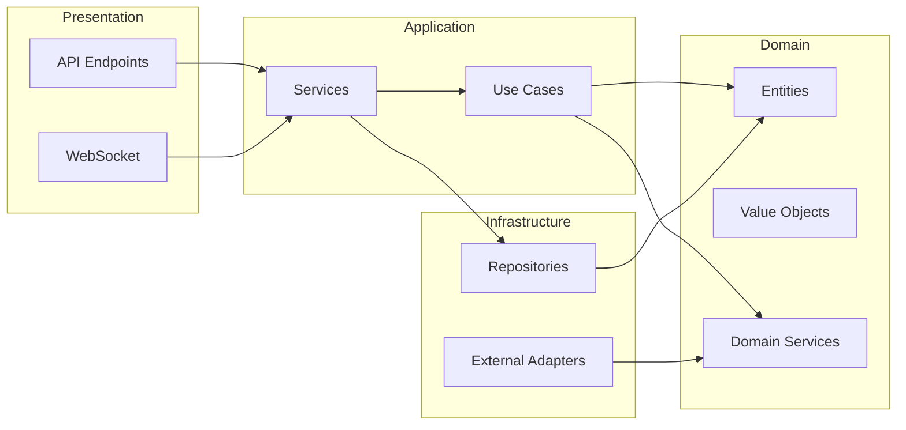
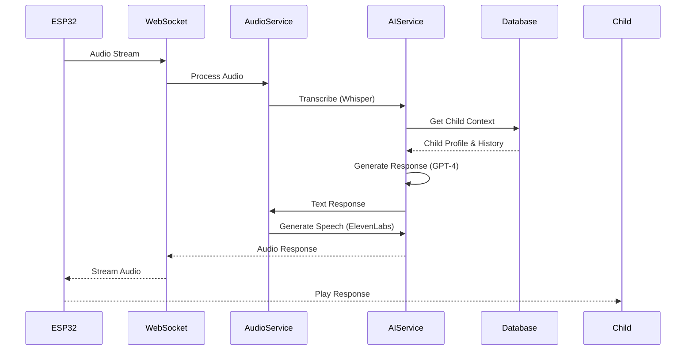
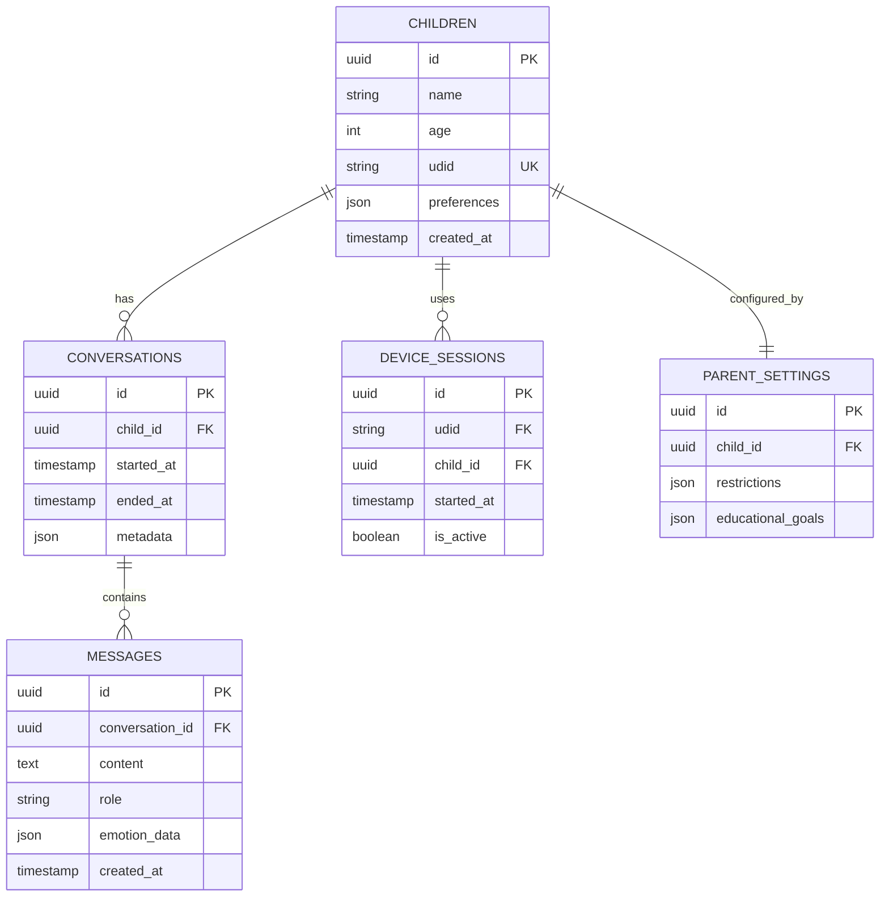
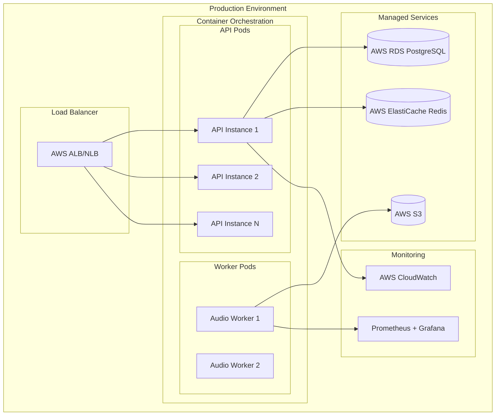

# 🏗️ ARCHITECTURE - البنية المعمارية لمشروع AI Teddy Bear 2025

> **🎯 هدف المعمارية:** نظام آمن وقابل للتوسع للعب AI التفاعلي للأطفال مع حماية متقدمة

---

## 📊 **لوحة القيادة المعمارية**

```
🏗️ ARCHITECTURE HEALTH DASHBOARD  
┌─────────────────────────────────────────────┐
│ 🎯 Clean Architecture: ████████░░ 80%      │
│ 🔒 Security Design:    ███░░░░░░░ 30%      │
│ 🚀 Scalability:        ██████░░░░ 60%      │
│ 👶 Child Safety:       ██░░░░░░░░ 20%      │
│ 🤖 AI Integration:     ███████░░░ 70%      │
└─────────────────────────────────────────────┘

⚡ CURRENT STATE: 🟡 TRANSITIONING
🎯 TARGET STATE:  🟢 ENTERPRISE-READY
📅 ETA:          4 weeks with focus
```

---

## 🎯 **نظرة عامة على النظام**

### 🌐 **System Overview Diagram**

<function_calls>
<invoke name="create_diagram">
<parameter name="content">graph TD
    A[Parent Mobile App] --> B[Cloud API Gateway]
    C[ESP32 Teddy Bear] --> B
    B --> D[Authentication Service]
    B --> E[Child Management Service]
    B --> F[AI Conversation Engine]
    
    D --> G[Parent Database]
    E --> H[Child Profiles DB]
    F --> I[AI Services]
    
    I --> J[OpenAI GPT-4]
    I --> K[Hume AI Emotion]
    I --> L[ElevenLabs TTS]
    I --> M[Whisper STT]
    
    F --> N[Content Safety Filter]
    F --> O[Child Behavior Analyzer]
    
    P[Audit & Monitoring] --> Q[Security Dashboard]
    P --> R[Parent Reports]
    
    B --> P
    
    style A fill:#e1f5fe
    style C fill:#f3e5f5
    style F fill:#fff3e0
    style N fill:#ffebee
    style P fill:#e8f5e8
</code_block_to_apply_changes_from>
</invoke>
</function_calls>

## 📐 System Overview

The AI Teddy Bear system is a cloud-based interactive toy platform that processes children's voice inputs and generates intelligent, personalized responses using advanced AI services.

## 🗺️ High-Level Architecture

```mermaid
graph TB
    subgraph "Edge Devices"
        ESP32[ESP32 Teddy Bear]
        Mobile[Mobile App]
    end
    
    subgraph "API Gateway"
        Gateway[FastAPI Gateway]
        WS[WebSocket Manager]
    end
    
    subgraph "Core Services"
        Auth[Authentication Service]
        Audio[Audio Processing]
        AI[AI Service Layer]
        Child[Child Profile Service]
    end
    
    subgraph "AI Providers"
        OpenAI[OpenAI API]
        Hume[Hume AI]
        Whisper[Whisper ASR]
        ElevenLabs[ElevenLabs TTS]
    end
    
    subgraph "Data Layer"
        Redis[(Redis Cache)]
        PostgreSQL[(PostgreSQL)]
        S3[S3 Storage]
    end
    
    subgraph "Monitoring"
        Prometheus[Prometheus]
        Grafana[Grafana]
        Logs[Log Aggregation]
    end
    
    ESP32 -->|Audio Stream| WS
    Mobile -->|HTTPS| Gateway
    
    Gateway --> Auth
    Gateway --> Audio
    Gateway --> Child
    
    Audio --> AI
    AI --> OpenAI
    AI --> Hume
    AI --> Whisper
    AI --> ElevenLabs
    
    Auth --> Redis
    Child --> PostgreSQL
    Audio --> S3
    
    Gateway --> Prometheus
    Core Services --> Logs
```

## 🧱 Component Architecture

### 1. **Presentation Layer**
- ESP32 Hardware Interface
- Mobile Applications (React Native)
- Web Dashboard (React)
- WebSocket Real-time Communication

### 2. **Application Layer**
- FastAPI REST Endpoints
- WebSocket Handlers
- GraphQL API (Optional)
- API Gateway with Rate Limiting

### 3. **Domain Layer**
- Child Aggregate (DDD)
- Conversation Entity
- Emotion Analysis Domain
- Educational Content Domain

### 4. **Infrastructure Layer**
- Database Repositories
- External AI Service Adapters
- Message Queue (Redis Pub/Sub)
- File Storage Services

## 📦 Module Dependencies



## 🔄 Data Flow

### Voice Interaction Flow



## 🗄️ Database Schema



## 🚀 Deployment Architecture



## 🔐 Security Architecture

### Security Layers

1. **Network Security**
   - TLS 1.3 for all communications
   - VPC with private subnets
   - WAF rules for API protection

2. **Application Security**
   - JWT-based authentication
   - Role-based access control (RBAC)
   - Input validation and sanitization
   - Rate limiting per UDID

3. **Data Security**
   - Encryption at rest (AES-256)
   - Encryption in transit (TLS)
   - PII data anonymization
   - GDPR compliance measures

## 📊 Performance Considerations

### Optimization Strategies

1. **Caching**
   - Redis for session management
   - CDN for static assets
   - Database query result caching

2. **Async Processing**
   - FastAPI async endpoints
   - Background job processing
   - WebSocket for real-time updates

3. **Scaling**
   - Horizontal pod autoscaling
   - Database read replicas
   - Load balancing strategies

## 🔧 Technology Stack

### Backend
- **Framework:** FastAPI (Python 3.11+)
- **Database:** PostgreSQL 15+ with AsyncPG
- **Cache:** Redis 7+
- **Message Queue:** Redis Pub/Sub / RabbitMQ

### AI Services
- **LLM:** OpenAI GPT-4
- **Speech-to-Text:** OpenAI Whisper
- **Text-to-Speech:** ElevenLabs
- **Emotion AI:** Hume AI

### Infrastructure
- **Container:** Docker
- **Orchestration:** Kubernetes / ECS
- **Cloud:** AWS / Azure / GCP
- **Monitoring:** Prometheus + Grafana

### Frontend
- **Web:** React 18+ with TypeScript
- **Mobile:** React Native
- **State Management:** Redux Toolkit
- **UI Library:** Material-UI / Ant Design

## 🎯 Architecture Principles

1. **Clean Architecture**
   - Dependency inversion
   - Domain-driven design
   - Separation of concerns

2. **SOLID Principles**
   - Single Responsibility
   - Open/Closed
   - Liskov Substitution
   - Interface Segregation
   - Dependency Inversion

3. **12-Factor App**
   - Codebase in version control
   - Explicit dependencies
   - Configuration in environment
   - Backing services as resources

## 📈 Future Considerations

1. **Microservices Migration**
   - Extract audio processing service
   - Separate AI orchestration service
   - Independent scaling per service

2. **Event-Driven Architecture**
   - Event sourcing for conversation history
   - CQRS for read/write optimization
   - Apache Kafka for event streaming

3. **Edge Computing**
   - Local AI models on ESP32-S3
   - Offline mode capabilities
   - Edge-cloud synchronization

---

## 🤖 **AI-Powered Testing Integration**

### 🎯 **تحسين CI/CD بالذكاء الاصطناعي:**

```yaml
AI_Enhanced_Pipeline:
  Test_Generation:
    - Automatic test case generation using GPT-4
    - Edge case detection with machine learning
    - Child safety scenario testing
    
  Intelligent_Testing:
    - Risk-based test prioritization
    - Predictive failure analysis  
    - Adaptive test selection
    
  Child_Safety_AI:
    - Real-time content moderation testing
    - Bias detection in AI responses
    - Age-appropriate content validation
    
  Performance_AI:
    - Intelligent load test generation
    - Performance bottleneck prediction
    - Resource optimization suggestions
```

### 🛡️ **AI Safety Architecture:**

```
🤖 AI SAFETY LAYERS
┌─────────────────────────────────────────────┐
│ Layer 1: Input Validation & Sanitization   │
│ Layer 2: Content Safety Classification     │
│ Layer 3: Age-Appropriate Response Filter   │
│ Layer 4: Bias Detection & Mitigation       │
│ Layer 5: Emergency Response Triggers       │
│ Layer 6: Parental Notification System      │
└─────────────────────────────────────────────┘
```

### 🔄 **CI/CD مع AI Testing:**

```bash
# AI-Enhanced CI/CD Pipeline
name: 🤖 AI-Enhanced Testing Pipeline

jobs:
  ai-test-generation:
    - Generate tests using GPT-4 code analysis
    - Create child safety test scenarios
    - Generate performance test cases
    
  intelligent-testing:
    - Run risk-based test prioritization
    - Execute AI-powered security tests
    - Validate child content safety
    
  ai-analysis:
    - Analyze test results with ML
    - Generate improvement recommendations
    - Create automated bug reports
```

---

**🚨 هذه معمارية متقدمة مصممة للأمان والقابلية للتوسع والحماية المتقدمة للأطفال**

*📅 تاريخ المعمارية: 28 يناير 2025*  
*🎯 الحالة: معدة للتطبيق*  
*🔒 التصنيف: سري - للفريق التقني فقط* 