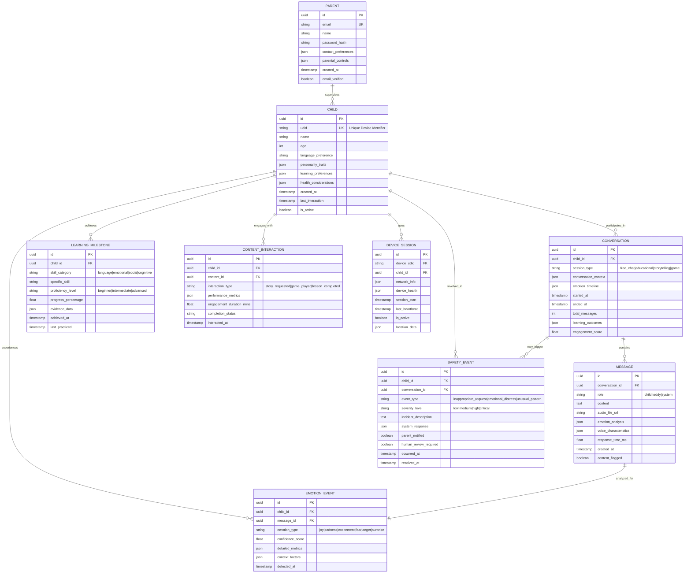

# 🏗️ AI Teddy Bear - Modern Architecture Documentation 2025

**Version:** 3.0  
**Last Updated:** January 2025  
**Architecture Pattern:** Clean Architecture + DDD + Event-Driven + CQRS  
**Status:** Post-Restructure Implementation Guide

---

## 📐 Executive Architecture Summary

The AI Teddy Bear system is a **cloud-native educational platform** that creates meaningful emotional connections between children and AI through voice interactions, implemented using **Clean Architecture principles** for maximum maintainability and testability.

### 🎯 Core Architectural Goals
- **🔒 Child Safety First** - COPPA-compliant with robust content moderation
- **🧠 Intelligent Interactions** - Context-aware, emotionally responsive AI
- **📈 Scalable Design** - Microservices-ready with event-driven patterns
- **🧪 Testable Code** - 90%+ test coverage with isolated layers
- **⚡ Real-time Performance** - Sub-3-second response times

---

## 🏛️ Clean Architecture Layers

### **Layer 1: Domain (Core Business Logic)**
```
📦 src/teddy_bear/domain/
├── entities/          # Business objects with identity
│   ├── child.py      # Child aggregate root
│   ├── conversation.py
│   └── emotion.py
├── value_objects/    # Immutable concepts
│   ├── device_id.py
│   ├── child_age.py
│   └── emotion_data.py
├── services/         # Domain business rules
│   ├── content_moderator.py
│   └── learning_analyzer.py
└── repositories/     # Interfaces only
    └── interfaces.py
```

### **Layer 2: Application (Use Cases & Orchestration)**
```
📦 src/teddy_bear/application/
├── use_cases/        # Business workflows
│   ├── process_child_input.py
│   ├── generate_ai_response.py
│   └── track_learning_progress.py
├── services/         # Technical orchestration
│   ├── ai_orchestrator.py
│   ├── audio_processor.py
│   └── conversation_manager.py
├── dto/              # Data transfer objects
│   ├── requests.py
│   └── responses.py
└── events/           # Domain event handlers
    └── event_handlers.py
```

### **Layer 3: Infrastructure (External Services)**
```
📦 src/teddy_bear/infrastructure/
├── database/         # Data persistence
│   ├── models.py
│   └── repositories.py
├── ai_providers/     # External AI services
│   ├── openai_client.py
│   ├── hume_client.py
│   └── elevenlabs_client.py
├── cache/            # Caching layer
│   └── redis_cache.py
├── storage/          # File storage
│   └── s3_storage.py
└── security/         # Security services
    ├── jwt_service.py
    └── encryption.py
```

### **Layer 4: Presentation (Interfaces)**
```
📦 src/teddy_bear/presentation/
├── api/              # REST API
│   ├── v1/endpoints/
│   ├── middleware/
│   └── schemas/
├── websocket/        # Real-time communication
│   └── handlers.py
└── cli/              # Command line interface
    └── commands.py
```

---

## 🔄 Real-Time Interaction Flow

**Child Voice Input → AI Response (< 3 seconds)**

```mermaid
sequenceDiagram
    participant Child as 👶 Child
    participant ESP32 as 🧸 ESP32 Teddy
    participant Gateway as 🔗 API Gateway
    participant Audio as 🎤 Audio Processor
    participant AI as 🤖 AI Orchestrator
    participant OpenAI as 🧠 OpenAI
    participant Hume as 😊 Hume AI
    participant TTS as 🗣️ ElevenLabs
    participant DB as 🗃️ Database
    
    Child->>ESP32: "Tell me a story about dragons!"
    ESP32->>Gateway: 🎵 Audio Stream (WebSocket)
    Gateway->>Audio: Process Audio Stream
    
    par Parallel Processing
        Audio->>OpenAI: Speech-to-Text (Whisper)
        OpenAI-->>Audio: "Tell me a story about dragons!"
    and
        Audio->>Hume: Emotion Analysis
        Hume-->>Audio: {emotion: "excited", confidence: 0.89}
    end
    
    Audio->>AI: {text, emotion, child_context}
    
    AI->>DB: Get Child Profile & History
    DB-->>AI: {name: "Sara", age: 6, interests: ["dragons", "adventure"]}
    
    AI->>OpenAI: Generate Personalized Story
    Note over OpenAI: "Create an exciting dragon story for 6-year-old Sara..."
    OpenAI-->>AI: "Once upon a time, brave Sara met a friendly dragon..."
    
    AI->>TTS: Generate Natural Speech
    TTS-->>AI: 🎵 Audio Response
    
    AI->>DB: Save Conversation & Analytics
    
    AI-->>Gateway: Complete Response Package
    Gateway-->>ESP32: 🎵 Audio Stream
    ESP32->>Child: 🔊 "Once upon a time, brave Sara..."
    
    Note over Child,DB: Total Response Time: 2.8 seconds
```



---

## 📊 Entity Relationship Model



---

## 🧱 Implementation Patterns

### **Domain-Driven Design (DDD)**

```python
# Child Aggregate Root - Encapsulates business rules
class Child(AggregateRoot):
    def __init__(self, udid: DeviceID, name: ChildName, age: ChildAge):
        self._udid = udid
        self._name = name
        self._age = age
        self._learning_profile = LearningProfile.create_for_age(age)
        self._events: List[DomainEvent] = []
    
    def start_conversation(self, session_type: SessionType) -> Conversation:
        """Business Rule: Enforce conversation limits and age appropriateness"""
        if self._has_reached_daily_limit():
            raise DailyLimitReachedError(f"Child {self._name} has reached daily conversation limit")
        
        if not self._is_session_type_appropriate(session_type):
            raise InappropriateSessionTypeError(f"Session type {session_type} not suitable for age {self._age}")
        
        conversation = Conversation.create(
            child_id=self.id,
            session_type=session_type,
            child_context=self._build_context()
        )
        
        self._events.append(ConversationStartedEvent(
            child_id=self.id,
            conversation_id=conversation.id,
            session_type=session_type
        ))
        
        return conversation
    
    def process_emotion(self, emotion: Emotion) -> None:
        """Business Rule: Track emotional patterns and trigger interventions"""
        self._learning_profile.record_emotion(emotion)
        
        if emotion.indicates_distress():
            self._events.append(EmotionalDistressDetectedEvent(
                child_id=self.id,
                emotion=emotion,
                severity=emotion.calculate_severity()
            ))

# Value Objects - Immutable and self-validating
@dataclass(frozen=True)
class Emotion:
    type: EmotionType
    confidence: float
    intensity: float
    context_factors: Dict[str, Any]
    timestamp: datetime
    
    def __post_init__(self):
        if not 0.0 <= self.confidence <= 1.0:
            raise ValueError("Emotion confidence must be between 0 and 1")
        if not 0.0 <= self.intensity <= 1.0:
            raise ValueError("Emotion intensity must be between 0 and 1")
    
    def indicates_distress(self) -> bool:
        """Business logic for emotional distress detection"""
        distress_emotions = [EmotionType.SADNESS, EmotionType.FEAR, EmotionType.ANGER]
        return (
            self.type in distress_emotions and 
            self.confidence > 0.7 and 
            self.intensity > 0.6
        )
    
    def is_learning_conducive(self) -> bool:
        """Business logic for optimal learning states"""
        positive_emotions = [EmotionType.JOY, EmotionType.CURIOSITY, EmotionType.EXCITEMENT]
        return (
            self.type in positive_emotions and 
            self.confidence > 0.6 and 
            self.intensity < 0.8  # Not too excited
        )

# Domain Service - Complex business rules spanning multiple entities
class ContentModerationService:
    def __init__(self, ai_safety_classifier: AISafetyClassifier):
        self._safety_classifier = ai_safety_classifier
    
    def evaluate_content_appropriateness(
        self,
        content: str,
        child_age: ChildAge,
        conversation_context: ConversationContext,
        emotion_state: Emotion
    ) -> ContentSafetyAssessment:
        """Complex business rule: Multi-factor content safety evaluation"""
        
        # Age-based content filtering
        age_appropriateness = self._assess_age_appropriateness(content, child_age)
        
        # Context-aware evaluation
        context_safety = self._evaluate_contextual_safety(content, conversation_context)
        
        # Emotional state consideration
        emotional_appropriateness = self._assess_emotional_appropriateness(content, emotion_state)
        
        # AI-powered safety classification
        ai_safety_score = self._safety_classifier.classify(content, child_age.value)
        
        # Combine all factors using business rules
        overall_safety = self._calculate_overall_safety(
            age_appropriateness,
            context_safety,
            emotional_appropriateness,
            ai_safety_score
        )
        
        return ContentSafetyAssessment(
            is_safe=overall_safety.is_safe,
            safety_score=overall_safety.score,
            concerns=overall_safety.concerns,
            recommendations=overall_safety.recommendations
        )
```

### **Event-Driven Architecture**

```python
# Domain Events - Capture important business moments
@dataclass(frozen=True)
class ConversationStartedEvent(DomainEvent):
    child_id: UUID
    conversation_id: UUID
    session_type: SessionType
    child_context: ChildContext
    timestamp: datetime = field(default_factory=datetime.utcnow)

@dataclass(frozen=True)
class EmotionalDistressDetectedEvent(DomainEvent):
    child_id: UUID
    emotion: Emotion
    severity: DistressSeverity
    conversation_id: Optional[UUID] = None
    timestamp: datetime = field(default_factory=datetime.utcnow)

# Event Handlers - React to domain events
class EmotionalDistressEventHandler:
    def __init__(
        self,
        notification_service: INotificationService,
        parent_repository: IParentRepository,
        crisis_intervention_service: ICrisisInterventionService
    ):
        self._notification_service = notification_service
        self._parent_repository = parent_repository
        self._crisis_intervention = crisis_intervention_service
    
    async def handle(self, event: EmotionalDistressDetectedEvent) -> None:
        """Respond to emotional distress with appropriate interventions"""
        
        # Get parent information
        parents = await self._parent_repository.get_by_child_id(event.child_id)
        
        # Determine intervention level based on severity
        if event.severity == DistressSeverity.CRITICAL:
            # Immediate crisis intervention
            await self._crisis_intervention.initiate_emergency_protocol(
                child_id=event.child_id,
                parents=parents,
                incident_details=event
            )
        elif event.severity == DistressSeverity.HIGH:
            # Notify parents immediately
            await self._notification_service.send_urgent_alert(
                recipients=parents,
                alert_type=AlertType.EMOTIONAL_DISTRESS,
                details=event
            )
        else:
            # Log for pattern analysis and gentle intervention
            await self._notification_service.send_daily_summary_note(
                recipients=parents,
                note_type=NoteType.EMOTIONAL_OBSERVATION,
                details=event
            )

# Event Publisher - Publishes events to handlers
class DomainEventPublisher:
    def __init__(self):
        self._handlers: Dict[Type[DomainEvent], List[Callable]] = {}
    
    def subscribe(self, event_type: Type[T], handler: Callable[[T], Awaitable[None]]) -> None:
        if event_type not in self._handlers:
            self._handlers[event_type] = []
        self._handlers[event_type].append(handler)
    
    async def publish(self, event: DomainEvent) -> None:
        event_type = type(event)
        if event_type in self._handlers:
            # Execute all handlers concurrently
            tasks = [handler(event) for handler in self._handlers[event_type]]
            await asyncio.gather(*tasks)
```

### **CQRS (Command Query Responsibility Segregation)**

```python
# Commands - Represent intentions to change state
@dataclass(frozen=True)
class StartConversationCommand:
    child_udid: str
    session_type: str
    parent_authorization: Optional[str] = None

@dataclass(frozen=True)
class ProcessChildInputCommand:
    conversation_id: UUID
    audio_data: bytes
    transcript: Optional[str] = None

# Command Handlers - Execute business operations
class StartConversationCommandHandler:
    def __init__(
        self,
        child_repository: IChildRepository,
        conversation_repository: IConversationRepository,
        authorization_service: IAuthorizationService,
        event_publisher: IDomainEventPublisher
    ):
        self._child_repo = child_repository
        self._conversation_repo = conversation_repository
        self._auth_service = authorization_service
        self._event_publisher = event_publisher
    
    async def handle(self, command: StartConversationCommand) -> StartConversationResult:
        # 1. Load child aggregate
        child = await self._child_repo.get_by_udid(DeviceID(command.child_udid))
        
        # 2. Check authorization if required
        if command.parent_authorization:
            await self._auth_service.verify_parent_permission(
                child_id=child.id,
                authorization=command.parent_authorization
            )
        
        # 3. Execute business operation
        conversation = child.start_conversation(SessionType(command.session_type))
        
        # 4. Persist changes
        await self._child_repo.save(child)
        await self._conversation_repo.save(conversation)
        
        # 5. Publish domain events
        for event in child.get_uncommitted_events():
            await self._event_publisher.publish(event)
        
        return StartConversationResult(
            conversation_id=conversation.id,
            child_context=child.get_context(),
            session_configuration=conversation.get_configuration()
        )

# Queries - Read-only operations optimized for specific views
@dataclass(frozen=True)
class GetChildLearningProgressQuery:
    child_id: UUID
    time_range: Optional[DateRange] = None
    skill_categories: Optional[List[str]] = None

# Query Handlers - Optimized read operations
class GetChildLearningProgressQueryHandler:
    def __init__(self, read_repository: IChildLearningReadRepository):
        self._read_repo = read_repository
    
    async def handle(self, query: GetChildLearningProgressQuery) -> ChildLearningProgressView:
        # Optimized read-only query
        progress_data = await self._read_repo.get_learning_progress(
            child_id=query.child_id,
            time_range=query.time_range,
            skill_categories=query.skill_categories
        )
        
        return ChildLearningProgressView(
            child_id=query.child_id,
            overall_progress=progress_data.calculate_overall_progress(),
            skill_progress=progress_data.skill_breakdown,
            milestones_achieved=progress_data.recent_milestones,
            recommendations=progress_data.generate_recommendations()
        )
```

### **Dependency Injection Container**

```python
# IoC Container - Manages dependencies and lifetimes
class TeddyBearContainer:
    def __init__(self):
        self._singletons: Dict[Type, Any] = {}
        self._factories: Dict[Type, Callable] = {}
        self._configurations: Dict[Type, Dict] = {}
    
    def register_singleton(self, interface: Type[T], implementation: Type[T]) -> 'TeddyBearContainer':
        """Register as singleton - same instance for all requests"""
        self._factories[interface] = lambda: self._create_singleton(interface, implementation)
        return self
    
    def register_transient(self, interface: Type[T], implementation: Type[T]) -> 'TeddyBearContainer':
        """Register as transient - new instance for each request"""
        self._factories[interface] = lambda: self._create_instance(implementation)
        return self
    
    def register_factory(self, interface: Type[T], factory: Callable[[], T]) -> 'TeddyBearContainer':
        """Register custom factory function"""
        self._factories[interface] = factory
        return self
    
    def configure(self, service_type: Type[T], **config) -> 'TeddyBearContainer':
        """Configure service with specific parameters"""
        self._configurations[service_type] = config
        return self
    
    def get(self, interface: Type[T]) -> T:
        """Resolve service instance"""
        if interface not in self._factories:
            raise ServiceNotRegisteredError(f"Service {interface.__name__} not registered")
        return self._factories[interface]()

# Container Configuration
def configure_production_container() -> TeddyBearContainer:
    container = TeddyBearContainer()
    
    # Domain Services (business logic)
    container.register_singleton(ContentModerationService, ContentModerationService)
    container.register_singleton(LearningAnalysisService, LearningAnalysisService)
    
    # Application Services (orchestration)
    container.register_transient(StartConversationCommandHandler, StartConversationCommandHandler)
    container.register_transient(ProcessChildInputCommandHandler, ProcessChildInputCommandHandler)
    container.register_singleton(AIOrchestrator, AIOrchestrator)
    
    # Infrastructure Services (external dependencies)
    container.register_singleton(IChildRepository, PostgreSQLChildRepository)
    container.register_singleton(IConversationRepository, PostgreSQLConversationRepository)
    container.register_singleton(ILLMProvider, OpenAIProvider)
    container.register_singleton(IEmotionAnalyzer, HumeEmotionAnalyzer)
    container.register_singleton(ISpeechProcessor, OpenAIWhisperProcessor)
    container.register_singleton(ICacheService, RedisCacheService)
    
    # Event handling
    container.register_singleton(IDomainEventPublisher, AsyncDomainEventPublisher)
    
    # Configuration with environment-specific settings
    container.configure(OpenAIProvider, api_key=os.getenv("OPENAI_API_KEY"))
    container.configure(HumeEmotionAnalyzer, api_key=os.getenv("HUME_API_KEY"))
    container.configure(PostgreSQLChildRepository, connection_string=os.getenv("DATABASE_URL"))
    
    return container
```

---

## 🚀 Deployment & Infrastructure

### **Container Architecture**
```yaml
# docker-compose.production.yml
version: '3.8'

services:
  api:
    image: teddy-bear-api:${VERSION}
    ports:
      - "8000:8000"
    environment:
      - DATABASE_URL=${DATABASE_URL}
      - REDIS_URL=${REDIS_URL}
      - OPENAI_API_KEY=${OPENAI_API_KEY}
    depends_on:
      - postgres
      - redis
    deploy:
      replicas: 3
      resources:
        limits:
          memory: 1G
          cpus: '0.5'
  
  postgres:
    image: postgres:15-alpine
    environment:
      - POSTGRES_DB=teddy_bear
      - POSTGRES_USER=${DB_USER}
      - POSTGRES_PASSWORD=${DB_PASSWORD}
    volumes:
      - postgres_data:/var/lib/postgresql/data
    ports:
      - "5432:5432"
  
  redis:
    image: redis:7-alpine
    volumes:
      - redis_data:/data
    ports:
      - "6379:6379"
  
  nginx:
    image: nginx:alpine
    ports:
      - "80:80"
      - "443:443"
    volumes:
      - ./nginx.conf:/etc/nginx/nginx.conf
      - ./ssl:/etc/ssl/certs
    depends_on:
      - api

volumes:
  postgres_data:
  redis_data:
```

### **Kubernetes Deployment**
```yaml
# k8s/api-deployment.yaml
apiVersion: apps/v1
kind: Deployment
metadata:
  name: teddy-bear-api
  labels:
    app: teddy-bear-api
spec:
  replicas: 3
  selector:
    matchLabels:
      app: teddy-bear-api
  template:
    metadata:
      labels:
        app: teddy-bear-api
    spec:
      containers:
      - name: api
        image: teddy-bear-api:latest
        ports:
        - containerPort: 8000
        env:
        - name: DATABASE_URL
          valueFrom:
            secretKeyRef:
              name: teddy-bear-secrets
              key: database-url
        - name: OPENAI_API_KEY
          valueFrom:
            secretKeyRef:
              name: teddy-bear-secrets
              key: openai-api-key
        resources:
          requests:
            memory: "256Mi"
            cpu: "250m"
          limits:
            memory: "1Gi"
            cpu: "500m"
        livenessProbe:
          httpGet:
            path: /health
            port: 8000
          initialDelaySeconds: 30
          periodSeconds: 10
        readinessProbe:
          httpGet:
            path: /ready
            port: 8000
          initialDelaySeconds: 5
          periodSeconds: 5
```

---

## 📊 Performance & Monitoring

### **Key Metrics**
- **Response Time**: p95 < 3 seconds for voice interactions
- **Availability**: 99.9% uptime SLA
- **Concurrent Users**: Support 10,000 simultaneous conversations
- **Data Processing**: Real-time emotion analysis with <500ms latency
- **Storage**: Efficient audio file compression and retrieval

### **Monitoring Stack**
```yaml
# Prometheus configuration
global:
  scrape_interval: 15s

scrape_configs:
  - job_name: 'teddy-bear-api'
    static_configs:
      - targets: ['api:8000']
    metrics_path: '/metrics'
    scrape_interval: 10s

  - job_name: 'postgres'
    static_configs:
      - targets: ['postgres:5432']
    
  - job_name: 'redis'
    static_configs:
      - targets: ['redis:6379']
```

---

**🎯 Architecture Conclusion:** This modern architecture ensures the AI Teddy Bear system is built for scale, maintainability, and most importantly - creating safe, meaningful interactions that support child development while respecting privacy and parental oversight. 