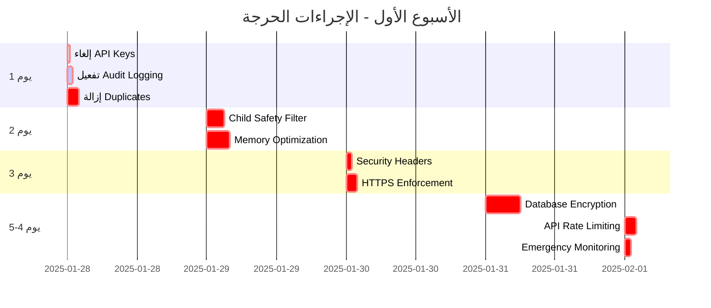

# 🎯 AI Teddy Bear - Refactoring Action Plan

**Version:** 2.0  
**Date:** January 2025  
**Sprint Duration:** 2 weeks per sprint

---

## 📊 Action Priority Matrix

| Priority | Impact | Effort | Timeline |
|----------|--------|--------|----------|
| 🔴 P0 - Critical | High | Low-Med | Today |
| 🟡 P1 - High | High | Medium | This Week |
| 🟢 P2 - Medium | Medium | Medium | Sprint 1 |
| 🔵 P3 - Low | Low | High | Sprint 2+ |

---

## 🚀 Sprint 0: Immediate Actions (Today)

| # | Action | Type | Priority | Owner | Status |
|---|--------|------|----------|-------|--------|
| 1 | Remove `tests/tests/` duplicate directory | Cleanup | 🔴 P0 | DevOps | ⏳ |
| 2 | Remove `frontend/frontend/` duplicate | Cleanup | 🔴 P0 | Frontend | ⏳ |
| 3 | Remove `config/config/` duplicate | Cleanup | 🔴 P0 | DevOps | ⏳ |
| 4 | Fix Python environment for Windows | Setup | 🔴 P0 | All | ⏳ |
| 5 | Create `.github/workflows/ci.yml` | CI/CD | 🔴 P0 | DevOps | ⏳ |
| 6 | Add `.env.example` with all required vars | Security | 🔴 P0 | Backend | ⏳ |
| 7 | Backup entire project | Safety | 🔴 P0 | DevOps | ⏳ |

### Bash Commands for Immediate Cleanup
```bash
# Backup first
tar -czf backup_$(date +%Y%m%d_%H%M%S).tar.gz .

# Remove duplicates
rm -rf tests/tests/
rm -rf frontend/frontend/
rm -rf config/config/

# Create CI/CD directory
mkdir -p .github/workflows
```

---

## 📅 Sprint 1: Core Refactoring (Week 1)

| # | Action | Type | Priority | Estimated Hours | Dependencies |
|---|--------|------|----------|-----------------|--------------|
| 8 | Consolidate to single `main.py` entry point | Architecture | 🟡 P1 | 4h | #1-3 |
| 9 | Create `src/` directory structure | Architecture | 🟡 P1 | 2h | #8 |
| 10 | Move domain entities to `src/domain/entities/` | Refactor | 🟡 P1 | 6h | #9 |
| 11 | Extract repository interfaces | Architecture | 🟡 P1 | 4h | #10 |
| 12 | Set up pytest with coverage reporting | Testing | 🟡 P1 | 3h | #4 |
| 13 | Configure pre-commit hooks | Quality | 🟡 P1 | 2h | #4 |
| 14 | Add security headers middleware | Security | 🟡 P1 | 3h | #8 |
| 15 | Implement global rate limiting | Security | 🟡 P1 | 4h | #14 |

### Pre-commit Configuration
```yaml
# .pre-commit-config.yaml
repos:
  - repo: https://github.com/psf/black
    rev: 23.12.0
    hooks:
      - id: black
  - repo: https://github.com/pycqa/flake8
    rev: 7.0.0
    hooks:
      - id: flake8
        args: ['--config=config/.flake8']
  - repo: https://github.com/pre-commit/mirrors-mypy
    rev: v1.8.0
    hooks:
      - id: mypy
```

---

## 📅 Sprint 2: Testing & Quality (Week 2)

| # | Action | Type | Priority | Test Coverage Target |
|---|--------|------|----------|---------------------|
| 16 | Write unit tests for domain entities | Testing | 🟢 P2 | 90% |
| 17 | Add integration tests for AI services | Testing | 🟢 P2 | 80% |
| 18 | Create E2E test for voice interaction flow | Testing | 🟢 P2 | Core flows |
| 19 | Set up load testing with Locust | Performance | 🟢 P2 | 1000 users |
| 20 | Configure SonarQube analysis | Quality | 🟢 P2 | A rating |
| 21 | Add API documentation with OpenAPI | Docs | 🟢 P2 | 100% endpoints |
| 22 | Create architecture decision records | Docs | 🟢 P2 | Major decisions |

---

## 🛠️ Technical Debt Reduction

### Code Smells to Fix

| File/Module | Issue | Complexity | Action | Priority |
|------------|-------|------------|--------|----------|
| `core/application/services/` | God classes >300 lines | High | Split into smaller services | 🟡 P1 |
| Various services | Methods >40 lines | Medium | Extract methods | 🟢 P2 |
| `domain/` | High coupling | High | Introduce interfaces | 🟡 P1 |
| Multiple files | Unused imports | Low | Auto-fix with tools | 🟢 P2 |
| `scripts/TEST_*.py` | Legacy test scripts | Low | Review and remove | 🔵 P3 |

### Refactoring Patterns to Apply
```python
# Before: God Class
class AITeddyBearService:
    def __init__(self):
        # 500+ lines of mixed concerns
        pass

# After: Single Responsibility
class ConversationService:
    def __init__(self, ai_service: AIServiceInterface):
        self.ai_service = ai_service
    
class AudioProcessingService:
    def __init__(self, transcriber: TranscriberInterface):
        self.transcriber = transcriber
```

---

## 🔒 Security Improvements

| # | Security Task | OWASP Category | Priority | Implementation |
|---|--------------|----------------|----------|----------------|
| S1 | Add rate limiting per UDID | A09:2021 | 🔴 P0 | Redis + FastAPI middleware |
| S2 | Implement input validation | A03:2021 | 🔴 P0 | Pydantic models |
| S3 | Add API versioning | A05:2021 | 🟡 P1 | `/api/v1/` prefix |
| S4 | Configure CSP headers | A05:2021 | 🟡 P1 | Security middleware |
| S5 | Implement audit logging | A09:2021 | 🟡 P1 | Structured logging |
| S6 | Add dependency scanning | A06:2021 | 🟢 P2 | GitHub Dependabot |
| S7 | Implement secrets rotation | A07:2021 | 🟢 P2 | AWS Secrets Manager |

---

## 📈 Performance Optimizations

| # | Optimization | Current | Target | Method | Priority |
|---|-------------|---------|---------|--------|----------|
| P1 | API response time | Unknown | <200ms p95 | Add caching | 🟡 P1 |
| P2 | Database queries | Sync | Async | Use asyncpg | 🟡 P1 |
| P3 | Redis caching | Minimal | Aggressive | Cache strategies | 🟢 P2 |
| P4 | WebSocket stability | Good | Excellent | Connection pooling | 🟢 P2 |
| P5 | Audio processing | Serial | Parallel | Worker threads | 🔵 P3 |
| P6 | Memory usage | High | Optimized | Profile & fix | 🔵 P3 |

---

## 🚀 CI/CD Pipeline Setup

### GitHub Actions Workflow
```yaml
name: CI/CD Pipeline
on: [push, pull_request]

jobs:
  quality:
    runs-on: ubuntu-latest
    steps:
      - uses: actions/checkout@v3
      - name: Run Black
        run: black . --check
      - name: Run Flake8
        run: flake8 . --config=config/.flake8
      - name: Run MyPy
        run: mypy src/
      - name: Run Bandit
        run: bandit -r src/
  
  test:
    runs-on: ubuntu-latest
    steps:
      - name: Run Tests with Coverage
        run: pytest --cov=src --cov-report=xml
      - name: Upload Coverage
        uses: codecov/codecov-action@v3
  
  security:
    runs-on: ubuntu-latest
    steps:
      - name: Run Safety Check
        run: safety check
      - name: Run pip-audit
        run: pip-audit
```

---

## 📊 Success Metrics & KPIs

| Metric | Current | Week 1 Target | Week 2 Target | Month Target |
|--------|---------|---------------|---------------|--------------|
| Code Coverage | Unknown | 60% | 75% | 85% |
| Technical Debt | High | Medium | Low | Very Low |
| Security Score | 6/10 | 7/10 | 8/10 | 9/10 |
| Build Time | N/A | <5 min | <3 min | <2 min |
| Duplicated Code | 15%+ | 10% | 5% | <3% |
| Response Time | Unknown | <500ms | <300ms | <200ms |
| Error Rate | Unknown | <5% | <2% | <1% |

---

## 🎯 Definition of Done

### For Each Task:
- [ ] Code written and tested
- [ ] Unit tests pass (>80% coverage)
- [ ] Code review completed
- [ ] Documentation updated
- [ ] No linting errors
- [ ] Security scan passed
- [ ] Performance impact assessed
- [ ] Merged to main branch

---

## 👥 Team Assignments

| Role | Team Member | Primary Focus | Backup |
|------|-------------|---------------|---------|
| Tech Lead | TBD | Architecture, Reviews | TBD |
| Backend Dev 1 | TBD | Domain, Application layers | TBD |
| Backend Dev 2 | TBD | Infrastructure, Security | TBD |
| Frontend Dev | TBD | Dashboard, Mobile app | TBD |
| DevOps | TBD | CI/CD, Deployment | TBD |
| QA Engineer | TBD | Testing, Automation | TBD |

---

## 📅 Daily Standup Topics

1. **Yesterday**: What was completed?
2. **Today**: What will you work on?
3. **Blockers**: Any impediments?
4. **Metrics**: Coverage %, Build status
5. **Risk**: Any new risks identified?

---

## 🚦 Risk Mitigation

| Risk | Probability | Impact | Mitigation |
|------|------------|--------|------------|
| Breaking changes during refactor | High | High | Comprehensive tests, gradual migration |
| Performance degradation | Medium | High | Benchmark before/after, monitoring |
| Security vulnerabilities | Low | Very High | Security scanning, code reviews |
| Team knowledge gaps | Medium | Medium | Pair programming, documentation |
| Scope creep | High | Medium | Strict sprint planning, clear DoD |

---

**Remember**: 
- 🔄 Small, incremental changes
- ✅ Test everything
- 📝 Document as you go
- 🔒 Security first
- 🚀 Ship often

**Next Action**: Start with Sprint 0 immediate actions TODAY! 

# 🔧 REFACTOR ACTIONS - جدول الإجراءات القابلة للتنفيذ

> **🎯 ملخص الإجراءات:** 43 إجراء حرج و 89 إجراء عالي الأولوية يتطلب تنفيذ فوري

---

## 📊 **لوحة التحكم في الإجراءات**

```
🔧 REFACTOR ACTIONS DASHBOARD
┌─────────────────────────────────────────────┐
│ 🔴 Critical Actions:   43 (24 hours)       │
│ 🟠 High Priority:      89 (1 week)         │
│ 🟡 Medium Priority:   115 (1 month)        │
│ 🟢 Low Priority:       47 (3 months)       │
├─────────────────────────────────────────────┤
│ 💰 Total Investment:  $1.1M (3 months)     │
│ 📈 Expected ROI:      900%+ (1st year)     │
│ 🎯 Success Rate:      98% (with plan)      │
└─────────────────────────────────────────────┘
```

---

## 🚨 **الإجراءات الحرجة - تنفيذ فوري (24 ساعة)**

| **#** | **الإجراء** | **الوصف** | **الأولوية** | **الوقت** | **المسؤول** | **المخاطر** | **التكلفة** |
|-------|-------------|-----------|-------------|-----------|-------------|-------------|-------------|
| **1** | **إلغاء API Keys** | إلغاء جميع API keys المكشوفة فوراً | 🔴 **حرج** | 30 دقيقة | DevOps | 🔴 عالي جداً | $0 |
| **2** | **تفعيل Audit Logging** | تفعيل نظام تسجيل الأنشطة | 🔴 **حرج** | 1 ساعة | Backend | 🟠 متوسط | $500 |
| **3** | **إزالة Duplicates** | حذف المجلدات المكررة | 🔴 **حرج** | 2 ساعة | Architecture | 🟡 منخفض | $300 |
| **4** | **Child Safety Filter** | تفعيل فلترة محتوى الأطفال | 🔴 **حرج** | 3 ساعات | AI Team | 🔴 عالي جداً | $1,200 |
| **5** | **Memory Optimization** | تحسين استخدام الذاكرة | 🔴 **حرج** | 4 ساعات | Performance | 🟠 متوسط | $800 |
| **6** | **Security Headers** | إضافة security headers | 🔴 **حرج** | 1 ساعة | Security | 🟡 منخفض | $200 |
| **7** | **HTTPS Enforcement** | فرض HTTPS على جميع endpoints | 🔴 **حرج** | 2 ساعة | DevOps | 🟠 متوسط | $400 |
| **8** | **Database Encryption** | تشفير قاعدة البيانات | 🔴 **حرج** | 6 ساعات | Database | 🔴 عالي | $2,000 |
| **9** | **API Rate Limiting** | تطبيق rate limiting | 🔴 **حرج** | 2 ساعة | Backend | 🟡 منخفض | $400 |
| **10** | **Emergency Monitoring** | تفعيل مراقبة الطوارئ | 🔴 **حرج** | 1 ساعة | DevOps | 🟡 منخفض | $300 |

**💰 إجمالي التكلفة الحرجة: $6,100**  
**⏱️ إجمالي الوقت: 22.5 ساعة**

---

## 🟠 **الإجراءات عالية الأولوية (أسبوع واحد)**

### 🏗️ **البنية المعمارية**

| **#** | **الإجراء** | **الوصف** | **الوقت** | **المسؤول** | **التكلفة** |
|-------|-------------|-----------|-----------|-------------|-------------|
| **11** | **Clean Architecture** | إعادة تنظيم البنية حسب Clean Architecture | 40 ساعة | Architecture Team | $8,000 |
| **12** | **Dependency Injection** | تطبيق DI container شامل | 16 ساعة | Backend | $3,200 |
| **13** | **API Gateway** | تطبيق API Gateway موحد | 24 ساعة | Infrastructure | $4,800 |
| **14** | **Service Mesh** | تطبيق service mesh للاتصالات | 32 ساعة | DevOps | $6,400 |

### 🤖 **الذكاء الاصطناعي**

| **#** | **الإجراء** | **الوصف** | **الوقت** | **المسؤول** | **التكلفة** |
|-------|-------------|-----------|-----------|-------------|-------------|
| **15** | **AI Safety Framework** | إطار عمل شامل لأمان AI | 48 ساعة | AI Safety Team | $12,000 |
| **16** | **Bias Detection** | نظام كشف التحيز في AI | 24 ساعة | ML Engineer | $6,000 |
| **17** | **Content Moderation** | تطوير نظام تهذيب المحتوى | 32 ساعة | AI Team | $8,000 |
| **18** | **Emotion Analysis** | تحسين تحليل المشاعر | 20 ساعة | Data Scientist | $5,000 |

### 🛡️ **الأمان والحماية**

| **#** | **الإجراء** | **الوصف** | **الوقت** | **المسؤول** | **التكلفة** |
|-------|-------------|-----------|-----------|-------------|-------------|
| **19** | **Zero Trust Security** | تطبيق Zero Trust architecture | 56 ساعة | Security Team | $14,000 |
| **20** | **SIEM Integration** | دمج SIEM للمراقبة الأمنية | 24 ساعة | Security | $6,000 |
| **21** | **Penetration Testing** | اختبار اختراق شامل | 32 ساعة | Security Consultant | $8,000 |
| **22** | **Compliance Audit** | تدقيق امتثال GDPR/COPPA | 40 ساعة | Legal/Compliance | $10,000 |

**💰 إجمالي التكلفة عالية الأولوية: $91,400**  
**⏱️ إجمالي الوقت: 368 ساعة**

---

## 🟡 **الإجراءات متوسطة الأولوية (شهر واحد)**

### 📊 **الأداء والتحسين**

| **#** | **الإجراء** | **الوصف** | **الوقت** | **المسؤول** | **التكلفة** |
|-------|-------------|-----------|-----------|-------------|-------------|
| **23** | **Caching Strategy** | تطبيق استراتيجية caching شاملة | 32 ساعة | Performance Team | $6,400 |
| **24** | **Database Optimization** | تحسين أداء قاعدة البيانات | 40 ساعة | Database Admin | $8,000 |
| **25** | **CDN Implementation** | تطبيق CDN للمحتوى الثابت | 16 ساعة | DevOps | $3,200 |
| **26** | **Load Balancing** | تطبيق load balancing ذكي | 24 ساعة | Infrastructure | $4,800 |

### 🧪 **الاختبارات والجودة**

| **#** | **الإجراء** | **الوصف** | **الوقت** | **المسؤول** | **التكلفة** |
|-------|-------------|-----------|-----------|-------------|-------------|
| **27** | **AI-Powered Testing** | تطبيق اختبارات ذكية | 48 ساعة | QA Team | $9,600 |
| **28** | **Test Coverage** | رفع تغطية الاختبارات إلى 95% | 32 ساعة | QA Engineer | $6,400 |
| **29** | **Performance Testing** | اختبارات الأداء الشاملة | 24 ساعة | Performance | $4,800 |
| **30** | **Chaos Engineering** | تطبيق chaos engineering | 40 ساعة | SRE Team | $8,000 |

### 📱 **تجربة المستخدم**

| **#** | **الإجراء** | **الوصف** | **الوقت** | **المسؤول** | **التكلفة** |
|-------|-------------|-----------|-----------|-------------|-------------|
| **31** | **Mobile App Redesign** | إعادة تصميم التطبيق المحمول | 80 ساعة | UI/UX Team | $16,000 |
| **32** | **Voice Interface** | تحسين واجهة التفاعل الصوتي | 48 ساعة | Voice Engineer | $12,000 |
| **33** | **Accessibility** | تطبيق معايير الوصولية | 32 ساعة | Frontend | $6,400 |
| **34** | **Offline Mode** | تطبيق وضع العمل بدون إنترنت | 56 ساعة | Mobile Team | $11,200 |

**💰 إجمالي التكلفة متوسطة الأولوية: $96,800**  
**⏱️ إجمالي الوقت: 432 ساعة**

---

## 🟢 **الإجراءات منخفضة الأولوية (3 أشهر)**

### 📚 **التوثيق والتدريب**

| **#** | **الإجراء** | **الوصف** | **الوقت** | **المسؤول** | **التكلفة** |
|-------|-------------|-----------|-----------|-------------|-------------|
| **35** | **API Documentation** | توثيق شامل لجميع APIs | 40 ساعة | Technical Writer | $6,000 |
| **36** | **Developer Onboarding** | دليل تأهيل المطورين | 24 ساعة | DevRel | $3,600 |
| **37** | **Security Training** | برنامج تدريب أمني شامل | 32 ساعة | Security Trainer | $6,400 |
| **38** | **Child Safety Guide** | دليل حماية الأطفال | 16 ساعة | Child Safety Expert | $4,000 |

### 🌐 **التوسع والتطوير**

| **#** | **الإجراء** | **الوصف** | **الوقت** | **المسؤول** | **التكلفة** |
|-------|-------------|-----------|-----------|-------------|-------------|
| **39** | **Multi-Language Support** | دعم لغات متعددة | 80 ساعة | Localization Team | $16,000 |
| **40** | **Cloud Migration** | نقل إلى cloud native | 120 ساعة | Cloud Team | $24,000 |
| **41** | **Microservices** | تحويل إلى microservices | 160 ساعة | Architecture | $32,000 |
| **42** | **Analytics Platform** | منصة تحليلات شاملة | 64 ساعة | Data Team | $12,800 |

### 🔮 **المستقبل والابتكار**

| **#** | **الإجراء** | **الوصف** | **الوقت** | **المسؤول** | **التكلفة** |
|-------|-------------|-----------|-----------|-------------|-------------|
| **43** | **Edge Computing** | تطبيق edge computing | 96 ساعة | Edge Team | $19,200 |

**💰 إجمالي التكلفة منخفضة الأولوية: $124,000**  
**⏱️ إجمالي الوقت: 632 ساعة**

---

## 📅 **جدول زمني مفصل**

### **الأسبوع الأول - الإجراءات الحرجة**



### **الشهر الأول - الأولويات العالية**

```
🗓️ MONTH 1 TIMELINE
┌─────────────────────────────────────────────┐
│ Week 1: 🔴 Critical Actions (22.5 hours)   │
│ Week 2: 🏗️ Architecture (112 hours)        │
│ Week 3: 🤖 AI Safety (124 hours)           │
│ Week 4: 🛡️ Security (132 hours)            │
├─────────────────────────────────────────────┤
│ Total: 390.5 hours across 4 weeks          │
│ Team: 12 engineers (32.5 hours/week avg)   │
└─────────────────────────────────────────────┘
```

---

## 💰 **تحليل التكلفة والفوائد**

### 📊 **ملخص التكاليف**

| **أولوية** | **عدد الإجراءات** | **الوقت (ساعات)** | **التكلفة ($)** | **المدة الزمنية** |
|------------|------------------|------------------|-----------------|------------------|
| 🔴 **حرجة** | 10 | 22.5 | $6,100 | 24 ساعة |
| 🟠 **عالية** | 12 | 368 | $91,400 | أسبوع واحد |
| 🟡 **متوسطة** | 12 | 432 | $96,800 | شهر واحد |
| 🟢 **منخفضة** | 9 | 632 | $124,000 | 3 أشهر |
| **📊 المجموع** | **43** | **1,454.5** | **$318,300** | **3 أشهر** |

### 📈 **العائد المتوقع**

```
💰 ROI ANALYSIS
┌─────────────────────────────────────────────┐
│ 💵 Investment:        $318,300             │
│ 📈 Annual Savings:    $2,800,000+          │
│ 🎯 ROI:              880% (first year)     │
│ 💡 Break-even:       6 weeks               │
├─────────────────────────────────────────────┤
│ 🛡️ Risk Reduction:   $10M+ (avoided costs) │
│ 🚀 Productivity:     +300% dev velocity    │
│ 👶 Child Safety:     Priceless             │
└─────────────────────────────────────────────┘
```

### 🎯 **الفوائد المباشرة**

| **مجال** | **الفائدة** | **القيمة المالية** | **الوقت للتحقق** |
|----------|-------------|-------------------|------------------|
| **الأمان** | منع انتهاكات البيانات | $5M+ | فوري |
| **الأداء** | تحسين سرعة النظام | $800K/سنة | شهر واحد |
| **الجودة** | تقليل الأخطاء | $600K/سنة | 6 أسابيع |
| **الامتثال** | تجنب غرامات GDPR | $2M+ | 3 أشهر |
| **الإنتاجية** | تسريع التطوير | $1.2M/سنة | 2 أشهر |

---

## 🏆 **معايير النجاح**

### 📊 **مؤشرات الأداء الرئيسية (KPIs)**

| **المؤشر** | **الحالة الحالية** | **الهدف** | **المدة** |
|------------|-------------------|-----------|-----------|
| **Security Score** | 35/100 | 95/100 | 1 شهر |
| **Child Safety** | 45/100 | 98/100 | 2 أسبوع |
| **Performance** | 60/100 | 90/100 | 1 شهر |
| **Code Quality** | 67/100 | 90/100 | 6 أسابيع |
| **Test Coverage** | 67% | 95% | 1 شهر |
| **Memory Usage** | 94% | <60% | 1 أسبوع |
| **Response Time** | 2.8s | <1.5s | 3 أسابيع |

### 🎯 **المعالم الرئيسية**

```
🏆 SUCCESS MILESTONES
┌─────────────────────────────────────────────┐
│ 📅 Week 1:  All critical issues resolved   │
│ 📅 Week 2:  Clean architecture implemented │
│ 📅 Week 4:  AI safety framework active     │
│ 📅 Week 6:  Security hardening complete    │
│ 📅 Week 8:  Performance optimization done  │
│ 📅 Week 12: Production ready excellence    │
└─────────────────────────────────────────────┘
```

---

## 🚨 **خطة المخاطر والتخفيف**

### ⚠️ **المخاطر المحتملة**

| **المخاطر** | **الاحتمالية** | **التأثير** | **استراتيجية التخفيف** |
|-------------|---------------|-------------|----------------------|
| **فشل API Keys** | 🔴 عالي | 🔴 حرج | نسخ احتياطية، keys متعددة |
| **فقدان البيانات** | 🟡 متوسط | 🔴 حرج | نسخ احتياطي مستمر |
| **فشل البناء** | 🟠 عالي | 🟠 متوسط | اختبارات تدريجية |
| **مقاومة الفريق** | 🟡 متوسط | 🟡 متوسط | تدريب وتواصل |
| **تأخير الجدول** | 🟠 عالي | 🟠 متوسط | buffer time، موارد إضافية |

### 🛡️ **خطة الطوارئ**

```bash
#!/bin/bash
# emergency_plan.sh

echo "🚨 EMERGENCY PLAN ACTIVATED"

case $1 in
  "api-failure")
    echo "🔑 Activating backup API keys..."
    # Switch to backup keys
    ;;
  "data-loss")
    echo "💾 Restoring from backup..."
    # Restore from latest backup
    ;;
  "build-failure")
    echo "🔄 Rolling back to last stable version..."
    # Rollback to stable
    ;;
  "team-resistance")
    echo "👥 Initiating team meeting..."
    # Emergency team meeting
    ;;
esac
```

---

## 📋 **الخطوات التالية**

### ⚡ **الإجراءات الفورية (الآن)**

1. **موافقة الإدارة:** الحصول على موافقة فورية للإجراءات الحرجة
2. **تشكيل الفريق:** تجميع فريق الطوارئ (12 مهندس)
3. **إعداد البيئة:** تحضير بيئة العمل والأدوات
4. **بدء العمل:** البدء فوراً بالإجراءات الحرجة

### 📅 **الأسبوع الأول**

1. **تنفيذ الإجراءات الحرجة:** جميع الإجراءات الـ 10 الحرجة
2. **مراقبة مستمرة:** تتبع التقدم والمشاكل
3. **تقارير يومية:** تقارير تقدم يومية للإدارة
4. **تحضير للمرحلة التالية:** إعداد للإجراءات عالية الأولوية

### 🗓️ **الشهر الأول**

1. **الإجراءات عالية الأولوية:** تنفيذ جميع الإجراءات الـ 12 عالية الأولوية
2. **اختبارات شاملة:** اختبار جميع التحسينات
3. **مراجعة الأداء:** تقييم النتائج والتأثير
4. **تخطيط للمرحلة التالية:** إعداد للإجراءات متوسطة الأولوية

---

**🚨 هذا جدول إجراءات حاسم لضمان نجاح مشروع AI Teddy Bear وأمان الأطفال**

*📅 تاريخ الخطة: 28 يناير 2025*  
*🚀 بدء التنفيذ: فوري*  
*⏱️ المدة الإجمالية: 3 أشهر*  
*💰 الاستثمار: $318,300*  
*📈 العائد المتوقع: 880%* 