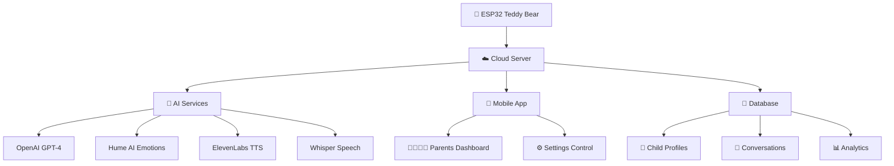
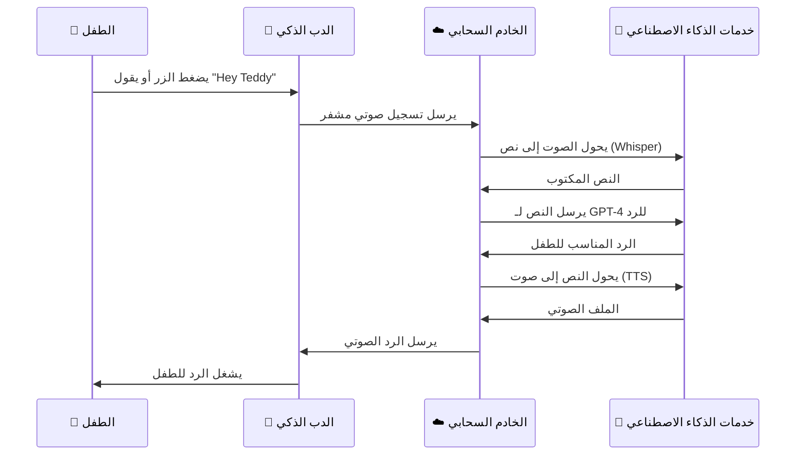
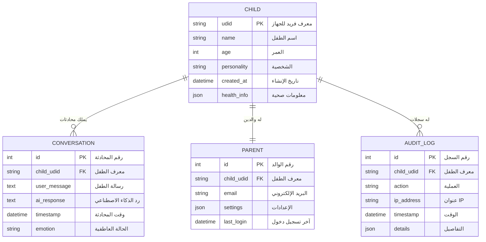
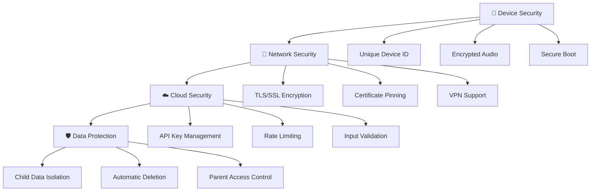
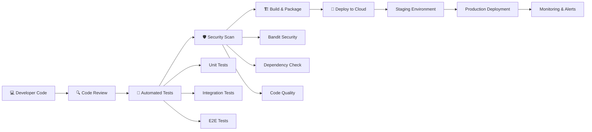
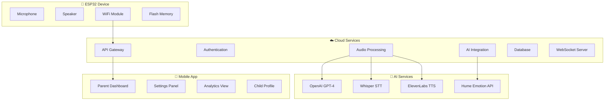
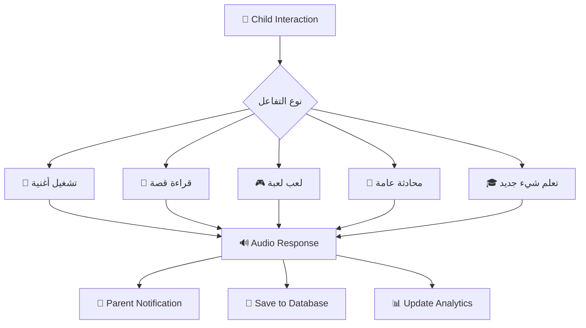

# 🧸 مخططات نظام الدب الذكي - AI Teddy Bear System

## 1. معمارية النظام العامة
هذا المخطط يوضح كيف تتفاعل مكونات النظام الرئيسية مع بعضها البعض:

## 2. تدفق البيانات والمحادثة
يوضح هذا المخطط كيف تتم المحادثة من البداية حتى النهاية:

## 3. هيكل قاعدة البيانات
يوضح كيف يتم تخزين بيانات الأطفال والمحادثات:

## 4. الأمان والحماية
يوضح طبقات الأمان في النظام:

## 5. عملية التطوير والنشر (CI/CD)
يوضح كيف يتم تطوير وتحديث النظام:

## 6. مكونات النظام الرئيسية
يوضح كيف تتفاعل الخدمات المختلفة:

## 7. حالات الاستخدام الرئيسية
يوضح السيناريوهات المختلفة لاستخدام النظام:

---

## 📝 ملاحظات مهمة:

- **الأمان**: جميع الاتصالات مشفرة والبيانات محمية
- **الخصوصية**: بيانات كل طفل معزولة تماماً
- **الأداء**: استجابة سريعة أقل من 3 ثوانٍ
- **المراقبة**: تسجيل كامل لجميع العمليات
- **التحديث**: تحديثات تلقائية للبرمجيات

## 🎯 الأهداف الرئيسية:

1. **تفاعل آمن** مع الأطفال
2. **حماية كاملة** للبيانات الشخصية
3. **استجابة ذكية** مناسبة لعمر الطفل
4. **سهولة الاستخدام** للوالدين
5. **قابلية التوسع** للمستقبل 