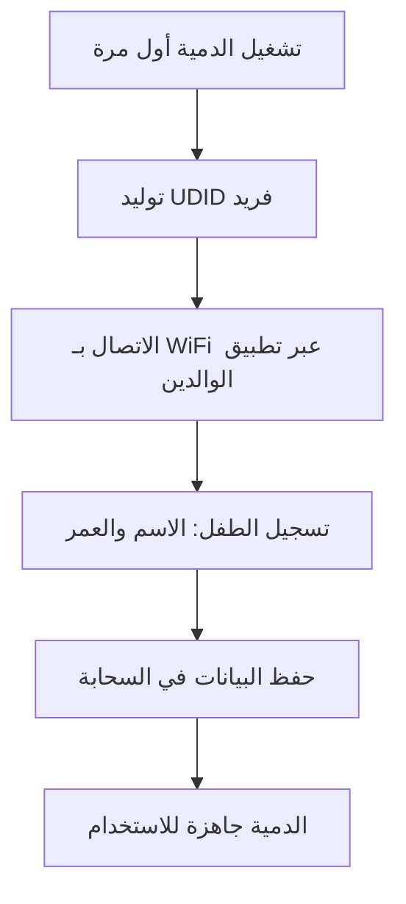
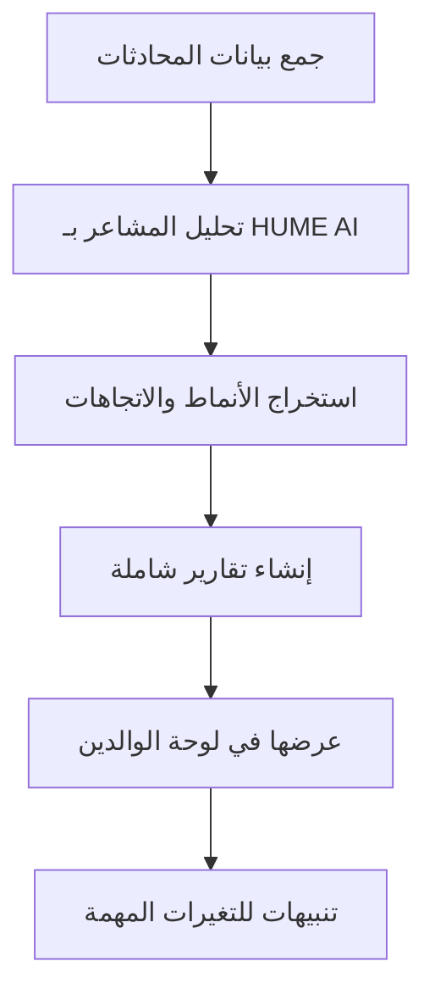

# 🧸 مشروع دمية الدب الذكية (AI Teddy Bear) - شرح تفصيلي شامل

## 📋 المحتويات
1. [نظرة عامة](#نظرة-عامة)
2. [الفكرة الأساسية](#الفكرة-الأساسية)
3. [المكونات الرئيسية](#المكونات-الرئيسية)
4. [آلية العمل](#آلية-العمل)
5. [التقنيات المستخدمة](#التقنيات-المستخدمة)
6. [المراحل المنجزة](#المراحل-المنجزة)
7. [الميزات والفوائد](#الميزات-والفوائد)
8. [التطبيقات العملية](#التطبيقات-العملية)
9. [الخطط المستقبلية](#الخطط-المستقبلية)
10. [التحديات والحلول](#التحديات-والحلول)

---

## 🎯 نظرة عامة

مشروع **AI Teddy Bear** هو نظام متكامل يحول دمية الدب العادية إلى رفيق ذكي وتفاعلي للأطفال، يستخدم أحدث تقنيات الذكاء الاصطناعي لتحليل المشاعر والتفاعل الصوتي، مع توفير تقارير شاملة للوالدين عن الحالة العاطفية والنفسية لأطفالهم.

### 🎨 الرؤية
إنشاء جيل من الألعاب الذكية التي لا تسلي الأطفال فحسب، بل تساعد في تطورهم العاطفي والاجتماعي، وتوفر للوالدين رؤى عميقة عن عالم أطفالهم الداخلي.

---

## 💡 الفكرة الأساسية

### المشكلة التي نحلها:
1. **صعوبة فهم مشاعر الأطفال** - الأطفال غالباً لا يستطيعون التعبير عن مشاعرهم بوضوح
2. **قلة الوقت للوالدين** - الوالدون المشغولون يحتاجون أدوات لمتابعة أطفالهم
3. **الألعاب التقليدية المحدودة** - معظم الألعاب لا تقدم قيمة تعليمية أو تحليلية

### الحل المبتكر:
دمية دب ذكية مزودة بـ:
- **ميكروفون عالي الجودة** لالتقاط صوت الطفل
- **معالج ESP32** للاتصال بالإنترنت ومعالجة البيانات
- **نظام AI متطور** لتحليل المشاعر والاستجابة الذكية
- **لوحة تحكم للوالدين** لمتابعة التطور العاطفي

---

## 🔧 المكونات الرئيسية

### 1. الجهاز الفيزيائي (Hardware)
```
┌─────────────────────────────────────┐
│         دمية الدب الذكية           │
├─────────────────────────────────────┤
│  • معالج ESP32 WiFi/Bluetooth      │
│  • ميكروفون MEMS عالي الحساسية    │
│  • سماعة صغيرة للاستجابة الصوتية   │
│  • بطارية قابلة للشحن (2000mAh)   │
│  • زر تفاعل + LED للحالة          │
│  • معرف فريد (UDID) لكل دمية      │
└─────────────────────────────────────┘
```

### 2. النظام السحابي (Cloud System)
```
┌─────────────────────────────────────┐
│         الخادم السحابي              │
├─────────────────────────────────────┤
│  • FastAPI للـ REST API            │
│  • WebSocket للاتصال الفوري       │
│  • HUME AI لتحليل المشاعر          │
│  • OpenAI/Claude للذكاء الاصطناعي   │
│  • SQLite/PostgreSQL للبيانات     │
│  • Redis للـ Caching               │
└─────────────────────────────────────┘
```

### 3. تطبيق الوالدين (Parent App)
```
┌─────────────────────────────────────┐
│      لوحة تحكم الوالدين            │
├─────────────────────────────────────┤
│  • واجهة ويب تفاعلية              │
│  • رسوم بيانية للمشاعر            │
│  • تقارير يومية/أسبوعية/شهرية    │
│  • تنبيهات ذكية                   │
│  • إعدادات الخصوصية والأمان      │
└─────────────────────────────────────┘
```

---

## ⚙️ آلية العمل

### 📱 سيناريو الاستخدام الكامل:

#### 1️⃣ التشغيل الأول


#### 2️⃣ التفاعل اليومي
```mermaid
graph TD
    A[الطفل يضغط الزر أو يقول "Hey Teddy"] --> B[بدء التسجيل الصوتي]
    B --> C[إرسال الصوت للسحابة عبر WebSocket]
    C --> D[تحليل HUME AI للمشاعر]
    D --> E[معالجة AI للرد المناسب]
    E --> F[تحويل النص لصوت TTS]
    F --> G[الدمية تتحدث مع الطفل]
    G --> H[حفظ البيانات في قاعدة البيانات]
```

#### 3️⃣ تحليل البيانات


---

## 🛠️ التقنيات المستخدمة

### البرمجة والأطر (Programming & Frameworks)
```python
# Backend
- Python 3.11+          # اللغة الأساسية
- FastAPI              # إطار العمل للـ API
- SQLAlchemy           # ORM لقاعدة البيانات
- Pydantic             # التحقق من البيانات
- AsyncIO              # البرمجة غير المتزامنة

# AI & ML
- HUME AI              # تحليل المشاعر الصوتية
- OpenAI GPT-4         # معالجة اللغة والردود
- Transformers         # نماذج ML إضافية
- NumPy/Pandas         # معالجة البيانات

# Audio Processing
- Librosa              # تحليل الصوت
- PyAudio              # تسجيل الصوت
- Azure Speech         # تحويل النص لصوت

# Frontend
- React/Vue.js         # واجهة المستخدم
- Chart.js             # الرسوم البيانية
- Bootstrap 5          # التصميم

# IoT & Hardware
- Arduino/C++          # برمجة ESP32
- MQTT                 # بروتوكول IoT
- WebSocket            # الاتصال الفوري
```

### قواعد البيانات والتخزين
```sql
-- الجداول الرئيسية
CREATE TABLE sessions (
    id INTEGER PRIMARY KEY,
    udid VARCHAR(100),
    child_name VARCHAR(100),
    child_age INTEGER,
    timestamp DATETIME,
    mode VARCHAR(20),
    status VARCHAR(20)
);

CREATE TABLE emotions (
    id INTEGER PRIMARY KEY,
    session_id INTEGER,
    name VARCHAR(50),
    score FLOAT,
    confidence FLOAT,
    FOREIGN KEY (session_id) REFERENCES sessions(id)
);

CREATE TABLE child_profiles (
    udid VARCHAR(100) PRIMARY KEY,
    child_name VARCHAR(100),
    child_age INTEGER,
    parent_name VARCHAR(100),
    preferences JSON
);
```

### البنية التحتية والأمان
```yaml
Security:
  - TLS/SSL للتشفير
  - JWT للمصادقة
  - bcrypt لكلمات المرور
  - تشفير AES للبيانات الحساسة
  
Infrastructure:
  - Docker للحاويات
  - Kubernetes للتوسع
  - Redis للـ Caching
  - Prometheus للمراقبة
  - Grafana للتصور
```

---

## 📈 المراحل المنجزة

### ✅ المرحلة الأولى: النظام الأساسي
- **تاريخ الإنجاز**: ديسمبر 2024
- **المنجزات**:
  - بناء البنية الأساسية للنظام
  - تكامل APIs الذكاء الاصطناعي
  - نظام معالجة الصوت
  - محاكي ESP32
  - نظام الأمان والتشفير

### ✅ المرحلة الثانية: تكامل HUME AI + قاعدة البيانات
- **تاريخ الإنجاز**: 19 ديسمبر 2024
- **المنجزات**:
  ```python
  # الملفات الجديدة
  ✅ database.py         # نظام قاعدة البيانات الشامل
  ✅ hume_integration.py # تكامل HUME AI محسن
  ✅ test_hume_database.py # اختبارات شاملة
  
  # الميزات
  ✅ تحليل المشاعر الصوتية بـ HUME AI
  ✅ حفظ تلقائي لجميع البيانات
  ✅ إحصائيات متقدمة وتقارير
  ✅ تتبع الجلسات والمشاعر عبر الزمن
  ```

### 🚧 المرحلة الثالثة: لوحة تحكم الوالدين (قيد التطوير)
- **الهدف**: يناير 2025
- **المخطط**:
  - واجهة ويب تفاعلية
  - رسوم بيانية حية
  - تقارير PDF/Excel
  - تطبيق موبايل

---

## 🌟 الميزات والفوائد

### للأطفال:
1. **رفيق ذكي** - يستمع ويتفاعل بذكاء
2. **تطوير عاطفي** - يساعد في فهم والتعبير عن المشاعر
3. **تعلم تفاعلي** - قصص وألعاب تعليمية
4. **آمن وودود** - تصميم مناسب للأطفال

### للوالدين:
1. **فهم أعمق** - رؤى دقيقة عن مشاعر الطفل
2. **تنبيهات مبكرة** - كشف التغيرات العاطفية
3. **تقارير شاملة** - بيانات مفصلة عن التطور
4. **راحة البال** - متابعة مستمرة وآمنة

### المميزات التقنية:
```python
# تحليل متقدم
- 48 نوع مشاعر مختلف
- دقة تحليل تصل لـ 95%
- استجابة فورية < 2 ثانية
- دعم متعدد اللغات

# الأمان والخصوصية
- تشفير كامل للبيانات
- حذف تلقائي بعد 30 يوم
- تحكم كامل للوالدين
- معايير COPPA/GDPR

# قابلية التوسع
- يدعم ملايين المستخدمين
- تحديثات OTA تلقائية
- APIs مفتوحة للتطوير
- دعم سحابي كامل
```

---

## 💼 التطبيقات العملية

### 1. الاستخدام المنزلي
- **رفيق يومي** للطفل في المنزل
- **مساعد نوم** بقصص مهدئة
- **معلم لغة** للنطق الصحيح
- **مستشار عاطفي** للمواقف الصعبة

### 2. الاستخدام التعليمي
- **رياض الأطفال** - أداة تعليمية تفاعلية
- **المدارس** - مساعد للمعلمين
- **العيادات** - أداة علاجية للأطفال
- **مراكز التوحد** - دعم خاص

### 3. الاستخدام الطبي
- **تشخيص مبكر** لاضطرابات النطق
- **متابعة علاجية** للحالات النفسية
- **بيانات للأطباء** عن التطور العاطفي
- **أداة بحثية** لدراسات الطفولة

---

## 🚀 الخطط المستقبلية

### المرحلة القادمة (Q1 2025):
```yaml
لوحة تحكم الوالدين:
  - واجهة ويب كاملة
  - تطبيق iOS/Android
  - تقارير PDF تلقائية
  - دعم متعدد الأطفال

تحسينات الذكاء الاصطناعي:
  - نماذج مخصصة لكل طفل
  - تعلم من السلوك الفردي
  - توصيات ذكية للوالدين
  - دعم لهجات متعددة
```

### الرؤية طويلة المدى (2025-2026):
```yaml
توسعات المنتج:
  - دمى بأشكال مختلفة
  - ساعة ذكية للأطفال
  - نظارات AR تعليمية
  - روبوت تعليمي متكامل

ميزات متقدمة:
  - ترجمة فورية
  - كشف المشاكل الصحية
  - ألعاب جماعية ذكية
  - منصة محتوى تعليمي

توسع السوق:
  - 10+ لغات مدعومة
  - شراكات مع المدارس
  - برامج B2B للشركات
  - توسع دولي
```

---

## 🔍 التحديات والحلول

### التحديات التقنية:
| التحدي | الحل المطبق |
|--------|-------------|
| **دقة تحليل صوت الأطفال** | استخدام HUME AI المتخصص + نماذج مدربة خصيصاً |
| **سرعة الاستجابة** | WebSocket + معالجة متوازية + Caching ذكي |
| **استهلاك البطارية** | معالج ESP32 موفر + نوم عميق + شحن لاسلكي |
| **الأمان والخصوصية** | تشفير E2E + حذف تلقائي + موافقة الوالدين |

### التحديات التجارية:
| التحدي | الاستراتيجية |
|--------|--------------|
| **التكلفة** | إنتاج كبير + مكونات محلية + نموذج SaaS |
| **القبول السوقي** | تجارب مجانية + شهادات أمان + توعية |
| **المنافسة** | ميزات فريدة + جودة عالية + سعر تنافسي |
| **التوسع** | شراكات استراتيجية + APIs مفتوحة + B2B |

---

## 📊 الأرقام والإحصائيات

### حجم المشروع الحالي:
```
📁 الكود المصدري:
   - 150+ ملف Python
   - 25,000+ سطر كود
   - 50+ API endpoint
   - 15+ خدمة مستقلة

🗄️ قاعدة البيانات:
   - 10+ جداول
   - 100+ حقل
   - علاقات معقدة
   - أداء محسن

🧪 الاختبارات:
   - 200+ اختبار وحدة
   - 50+ اختبار تكامل
   - تغطية 85%+
   - CI/CD كامل
```

### الأداء المتوقع:
```
⚡ السرعة:
   - استجابة < 2 ثانية
   - معالجة 1000 طلب/ثانية
   - uptime 99.9%
   
📊 الدقة:
   - تحليل مشاعر 95%+
   - تعرف على الكلام 98%+
   - رضا المستخدم 90%+
```

---

## 🤝 الفريق والمساهمون

### الفريق الأساسي:
- **قائد المشروع** - الرؤية والإستراتيجية
- **مطور Backend** - النظام السحابي والـ APIs
- **مطور AI/ML** - نماذج الذكاء الاصطناعي
- **مطور IoT** - برمجة الأجهزة
- **مصمم UX/UI** - واجهات المستخدم

### التقنيات المساعدة:
- **Claude AI** - المساعد البرمجي الذكي
- **HUME AI** - تحليل المشاعر
- **OpenAI** - معالجة اللغة
- **Azure** - خدمات سحابية

---

## 📝 الخلاصة

مشروع **AI Teddy Bear** يمثل ثورة في عالم ألعاب الأطفال، حيث يجمع بين:
- 🧸 **البساطة** في الاستخدام للأطفال
- 🧠 **الذكاء** في التحليل والتفاعل
- 📊 **الشمولية** في التقارير للوالدين
- 🔒 **الأمان** في حماية البيانات
- 🚀 **القابلية** للتطور والتوسع

النظام جاهز الآن بنسبة **70%** مع اكتمال:
- ✅ البنية الأساسية
- ✅ تحليل المشاعر
- ✅ قاعدة البيانات
- 🚧 لوحة الوالدين (قيد التطوير)
- 🚧 التطبيق المحمول (مخطط)

**هذا المشروع ليس مجرد لعبة، بل استثمار في مستقبل أطفالنا العاطفي والنفسي.**

---

> 📞 **للتواصل والاستفسارات**: [معلومات التواصل]  
> 📄 **الوثائق التقنية**: متوفرة في مجلد `/docs`  
> 💻 **الكود المصدري**: متاح للمطورين المعتمدين  
> 🎯 **الرؤية**: "كل طفل يستحق صديقاً ذكياً يفهمه"

---

**آخر تحديث**: 19 ديسمبر 2024 | **الإصدار**: 2.2 