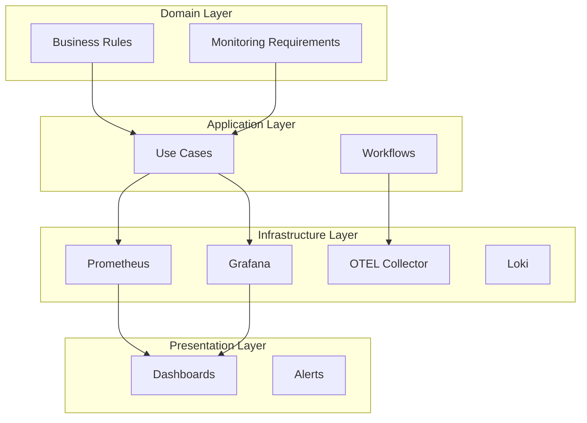

# AI Teddy Bear Monitoring Architecture Documentation

## 🎯 Overview

This document describes the **Clean Architecture** implementation for the AI Teddy Bear monitoring system. The architecture separates business logic from infrastructure, following Domain-Driven Design principles and enterprise best practices.

## 🏗️ Architecture Layers

### 1. Domain Layer (`domain/`)
**Business Logic - WHAT we monitor**

- **Purpose**: Defines core business requirements and rules for monitoring
- **Components**:
  - `monitoring-requirements.yaml`: Child safety metrics, AI quality metrics, compliance requirements
  - `monitoring-business-rules.yaml`: Thresholds, escalation rules, retention policies
- **Responsibilities**:
  - Child interaction monitoring rules
  - Safety violation thresholds (zero tolerance)
  - COPPA/GDPR compliance requirements
  - Business-critical alerting priorities

```yaml
# Example: Child Safety Rule (Zero Tolerance)
child_safety:
  max_inappropriate_content_per_day: 0
  max_privacy_violations_per_hour: 0
  max_unauthorized_access_per_minute: 3
```

### 2. Application Layer (`application/`)
**Use Cases - HOW we implement monitoring**

- **Purpose**: Orchestrates business workflows and use cases
- **Components**:
  - `monitoring-use-cases.yaml`: Real-time monitoring, incident response, compliance reporting
  - `monitoring-workflows.yaml`: Data pipelines, incident lifecycle, backup procedures
- **Responsibilities**:
  - Child interaction tracking workflows
  - Safety incident handling (< 30 seconds notification)
  - Performance degradation response
  - Compliance report generation

```yaml
# Example: Safety Incident Workflow
safety_incident_handling:
  description: "Handle child safety incidents immediately"
  sla: "< 30 seconds notification"
  flow:
    - detect_incident
    - gather_context
    - notify_stakeholders
    - track_resolution
```

### 3. Infrastructure Layer (`infrastructure/`)
**Implementation Details - WHERE we deploy**

#### Core Services (`core-services/`)
- `prometheus.yaml`: Metrics storage with enterprise features
- `grafana.yaml`: Visualization with AI Teddy specific configuration

#### Data Pipeline (`data-pipeline/`)
- `opentelemetry-collector.yaml`: Telemetry ingestion with auto-scaling

#### Storage (`storage/`)
- `persistent-volumes.yaml`: Storage management with retention policies

#### Security (`security/`)
- `rbac.yaml`: Role-based access control with COPPA compliance

### 4. Presentation Layer (`presentation/`)
**User Interface - HOW users interact**

- **Purpose**: Business-focused dashboards and visualizations
- **Components**:
  - `ai-teddy-monitoring-dashboards.yaml`: Child safety, interactions, system health
- **Features**:
  - Child Safety Metrics (real-time)
  - Parent Engagement Analytics
  - Learning Progress Visualization
  - System Health Overview

## 🚀 Deployment Architecture

### Component Relationships



### Deployment Order

1. **Phase 1: Foundation** (5 minutes)
   - Namespace, RBAC, Storage
   
2. **Phase 2: Infrastructure** (10 minutes)
   - Prometheus, OTEL Collector, Loki, Jaeger
   
3. **Phase 3: Presentation** (5 minutes)
   - Grafana, Dashboards, Alert Rules
   
4. **Phase 4: Scaling** (3 minutes)
   - HPA, PDB, Auto-scaling

## 📊 Business Metrics Integration

### Child Safety Metrics (Highest Priority)
```yaml
- inappropriate_content_blocked_total
- privacy_violations_detected_total
- unauthorized_access_attempts_total
- data_encryption_failures_total
```

### AI Quality Metrics
```yaml
- response_generation_time_seconds
- response_appropriateness_score
- safety_filter_triggers_total
- model_accuracy_percentage
```

### Parent Engagement Metrics
```yaml
- dashboard_views_total
- report_downloads_total
- settings_changes_total
- alert_acknowledgments_total
```

## 🔒 Security Implementation

### COPPA Compliance
- Zero data retention beyond necessary
- Parental consent verification
- Age-appropriate content filtering
- Child data access monitoring

### GDPR Compliance
- Right to be forgotten implementation
- Data processing audit trails
- Consent management
- Data portability features

### Network Security
- Namespace isolation
- Network policies (restricted ingress/egress)
- TLS encryption for all communications
- Non-root container execution

## 🔧 Configuration Management

### Environment-Specific Configurations

```yaml
# Development
retention: "7d"
replicas: 1
resources: "minimal"

# Production
retention: "30d"
replicas: 3
resources: "enterprise"
alerts: "enabled"
backup: "daily"
```

### Feature Flags
- Child safety monitoring: `ALWAYS_ENABLED`
- Performance monitoring: `ENABLED`
- Debug logging: `ENVIRONMENT_BASED`
- Advanced analytics: `CONFIGURABLE`

## 📈 Scaling Strategy

### Horizontal Pod Autoscaling
- **OTEL Collector**: 3-10 replicas based on ingestion rate
- **Prometheus**: 2-5 replicas based on query load
- **Grafana**: 2 replicas for availability

### Storage Scaling
- **Prometheus**: 100Gi with auto-expansion
- **Loki**: 50Gi with compression
- **Grafana**: 10Gi for dashboards

### Performance Targets
- API Response Time: < 2 seconds (95th percentile)
- Alert Notification: < 30 seconds for critical
- Dashboard Load Time: < 5 seconds
- Data Retention: 30 days (configurable)

## 🧪 Testing Strategy

### Integration Testing
```bash
# Run integration tests
python3 architecture/integration-test.py
```

### Health Checks
```bash
# Check all services
kubectl get pods -n ai-teddy-observability
kubectl get svc -n ai-teddy-observability
```

### Performance Testing
- Load testing with realistic child interaction patterns
- Stress testing for safety alert scenarios
- Failover testing for high availability

## 🚨 Alerting Rules

### Critical Alerts (Immediate Response)
- `ChildSafetyViolation`: Any safety violation detected
- `SystemDowntime`: Core service unavailable
- `DataBreach`: Unauthorized data access
- `PrivacyViolation`: COPPA/GDPR violation

### Warning Alerts (5-minute Response)
- `HighAPILatency`: Response time > 2 seconds
- `LowParentEngagement`: Below engagement thresholds
- `StorageCapacityLow`: Storage > 80% full

## 🔄 Maintenance Procedures

### Daily Operations
- Health check verification
- Performance metrics review
- Alert acknowledgment
- Backup verification

### Weekly Operations
- Dashboard updates
- Performance optimization
- Capacity planning review
- Security audit

### Monthly Operations
- Business metrics analysis
- Architecture review
- Dependency updates
- Disaster recovery testing

## 📁 File Structure

```
observability/architecture/
├── domain/
│   └── monitoring-requirements.yaml
├── application/
│   └── monitoring-use-cases.yaml
├── infrastructure/
│   ├── core-services/
│   │   ├── prometheus.yaml
│   │   └── grafana.yaml
│   ├── data-pipeline/
│   │   └── opentelemetry-collector.yaml
│   ├── storage/
│   │   └── persistent-volumes.yaml
│   └── security/
│       └── rbac.yaml
├── presentation/
│   └── dashboards/
│       └── ai-teddy-monitoring-dashboards.yaml
├── orchestration/
│   └── monitoring-orchestrator.yaml
├── integration-test.py
└── README.md
```

## 🚀 Quick Start

1. **Deploy the complete monitoring stack:**
```bash
kubectl apply -f architecture/ --recursive
```

2. **Wait for services to be ready:**
```bash
kubectl wait --for=condition=available --timeout=600s \
  deployment/prometheus,deployment/grafana,deployment/otel-collector \
  -n ai-teddy-observability
```

3. **Access dashboards:**
```bash
# Grafana (Admin/Admin)
kubectl port-forward svc/grafana 3000:3000 -n ai-teddy-observability

# Prometheus
kubectl port-forward svc/prometheus 9090:9090 -n ai-teddy-observability
```

4. **Run integration tests:**
```bash
python3 architecture/integration-test.py
```

## 🎯 Business Value

### For Children
- **Safety First**: Zero-tolerance monitoring for inappropriate content
- **Personalized Learning**: AI quality metrics ensure appropriate responses
- **Privacy Protection**: COPPA-compliant data handling

### For Parents
- **Peace of Mind**: Real-time safety monitoring and alerts
- **Engagement Insights**: Understanding child interaction patterns
- **Transparency**: Full visibility into AI responses and safety measures

### For Operations
- **Reliability**: 99.9% uptime with enterprise monitoring
- **Scalability**: Auto-scaling based on usage patterns
- **Compliance**: Automated COPPA/GDPR compliance monitoring

## 📞 Support

For technical support or questions about the monitoring architecture:
- **Documentation**: This README and inline YAML comments
- **Integration Tests**: Run `integration-test.py` for validation
- **Health Checks**: Monitor service endpoints for real-time status

---

*This documentation reflects the complete Clean Architecture implementation for AI Teddy Bear monitoring, with business logic properly separated from infrastructure concerns.* 