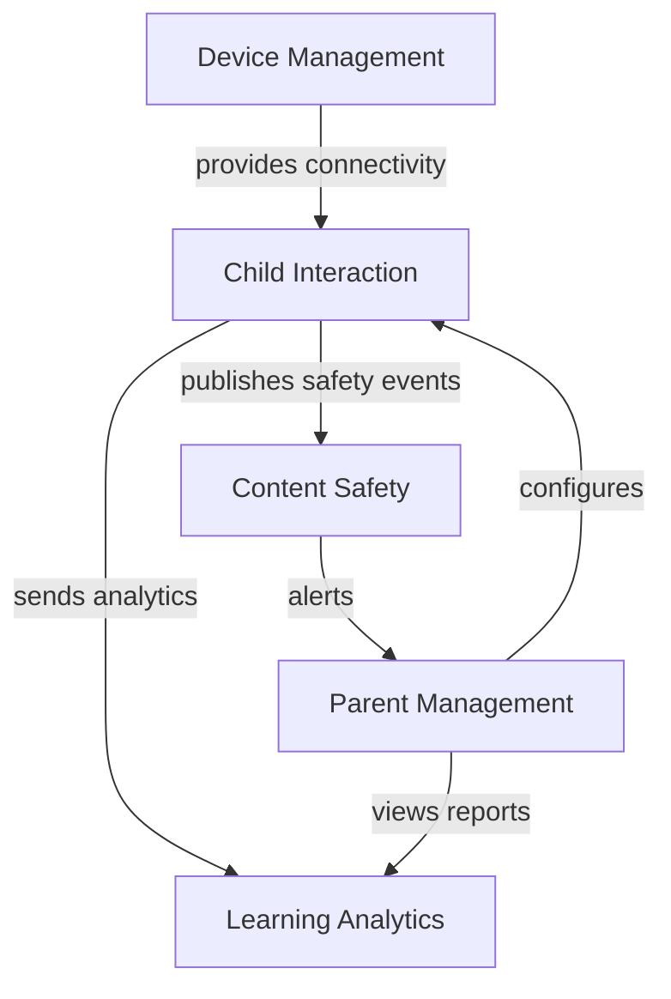

# 🏗️ AI Teddy Bear - Domain-Driven Design Architecture

## Overview
This document outlines the Domain-Driven Design (DDD) architecture for the AI Teddy Bear project, defining bounded contexts, aggregates, domain events, and clean architecture principles.

## 📊 Bounded Contexts

### 1. Child Interaction Context
**Purpose**: Manages all child-teddy bear interactions
**Core Concepts**:
- Child profile management
- Conversation handling
- Voice processing
- Response generation

**Aggregates**:
- `Child` (Aggregate Root)
- `Conversation`
- `VoiceInteraction`

### 2. Content Safety Context
**Purpose**: Ensures all content is safe and age-appropriate
**Core Concepts**:
- Content moderation
- Age appropriateness checking
- Safety scoring
- Violation reporting

**Aggregates**:
- `SafetyCheck` (Aggregate Root)
- `ContentViolation`
- `ModerationRule`

### 3. Parent Management Context
**Purpose**: Handles parent accounts and controls
**Core Concepts**:
- Parent authentication
- Child management
- Settings configuration
- Activity monitoring

**Aggregates**:
- `ParentAccount` (Aggregate Root)
- `ParentalControl`
- `ActivityReport`

### 4. Learning & Analytics Context
**Purpose**: Tracks learning progress and provides insights
**Core Concepts**:
- Learning metrics
- Progress tracking
- Behavioral analysis
- Recommendation engine

**Aggregates**:
- `LearningProfile` (Aggregate Root)
- `ProgressMetric`
- `LearningRecommendation`

### 5. Device Management Context
**Purpose**: Manages ESP32 devices and connectivity
**Core Concepts**:
- Device registration
- Firmware updates
- Connection management
- Device health monitoring

**Aggregates**:
- `TeddyDevice` (Aggregate Root)
- `DeviceConfiguration`
- `ConnectionStatus`

## 🔄 Context Map



## 📦 Aggregate Design

### Child Aggregate Example

```python
# Domain Entity
@dataclass
class ChildId:
    value: UUID

@dataclass 
class Child(AggregateRoot):
    id: ChildId
    name: str
    age: int
    parent_id: ParentId
    created_at: datetime
    preferences: ChildPreferences
    safety_settings: SafetySettings
    
    def start_conversation(self) -> Conversation:
        # Business logic
        pass
    
    def update_age(self, new_age: int) -> None:
        # Invariant: age must be between 3-12
        if not 3 <= new_age <= 12:
            raise InvalidAgeException()
        self.age = new_age
        self.raise_event(ChildAgeUpdatedEvent(self.id, new_age))
```

## 🎯 Domain Events

### Event Definitions

```python
@dataclass
class DomainEvent:
    event_id: UUID
    occurred_at: datetime
    aggregate_id: UUID

@dataclass
class ChildRegisteredEvent(DomainEvent):
    child_id: ChildId
    parent_id: ParentId
    child_name: str
    child_age: int

@dataclass
class InappropriateContentDetectedEvent(DomainEvent):
    child_id: ChildId
    content_type: str
    severity: str
    content_snippet: str

@dataclass
class LearningMilestoneAchievedEvent(DomainEvent):
    child_id: ChildId
    milestone_type: str
    achievement_data: dict
```

### Event Flow Example

```
Child speaks → VoiceProcessed → ContentAnalyzed → ResponseGenerated → SafetyChecked → ResponseDelivered
     ↓              ↓                ↓                    ↓                  ↓              ↓
  Event          Event            Event               Event              Event         Event
```

## 🏛️ Clean Architecture Layers

### 1. Domain Layer (innermost)
- Pure business logic
- No external dependencies
- Entities, Value Objects, Domain Services
- Domain Events

### 2. Application Layer
- Use Cases / Application Services
- DTOs
- Interfaces for external services
- CQRS Commands and Queries

### 3. Infrastructure Layer
- Implementations of interfaces
- Database access
- External service integrations
- Message queuing

### 4. Presentation Layer (outermost)
- REST APIs
- GraphQL endpoints
- WebSocket handlers
- UI components

## 📁 Project Structure

```
src/
├── core/
│   └── domain/                 # Domain Layer
│       ├── child_interaction/
│       │   ├── entities/
│       │   ├── value_objects/
│       │   ├── repositories/
│       │   ├── services/
│       │   └── events/
│       ├── content_safety/
│       ├── parent_management/
│       ├── learning_analytics/
│       └── device_management/
│
├── application/                # Application Layer
│   ├── child_interaction/
│   │   ├── commands/
│   │   ├── queries/
│   │   ├── handlers/
│   │   └── dto/
│   └── [other contexts]/
│
├── infrastructure/            # Infrastructure Layer
│   ├── persistence/
│   ├── messaging/
│   ├── external_services/
│   └── security/
│
└── presentation/             # Presentation Layer
    ├── api/
    ├── graphql/
    └── websocket/
```

## 🔌 Dependency Rules

1. **Domain → Nothing**: Domain layer has no dependencies
2. **Application → Domain**: Application depends only on Domain
3. **Infrastructure → Application, Domain**: Infrastructure implements interfaces
4. **Presentation → Application**: Presentation calls Application services

## 🎭 CQRS Implementation

### Command Side
```python
@dataclass
class StartConversationCommand:
    child_id: ChildId
    device_id: DeviceId
    voice_data: bytes

class StartConversationHandler:
    def handle(self, command: StartConversationCommand) -> ConversationId:
        # Handle command
        pass
```

### Query Side
```python
@dataclass
class GetChildConversationsQuery:
    child_id: ChildId
    date_range: DateRange

class GetChildConversationsHandler:
    def handle(self, query: GetChildConversationsQuery) -> List[ConversationDTO]:
        # Handle query
        pass
```

## 🔐 Security Integration

Each bounded context integrates with the security layer:

1. **Authentication**: JWT tokens validated at API gateway
2. **Authorization**: Role-based access per context
3. **Encryption**: All sensitive data encrypted at rest
4. **Audit**: All actions logged with correlation IDs

## 🚀 Migration Strategy

### Phase 1: Domain Modeling
- Define all entities and value objects
- Establish aggregate boundaries
- Create domain events

### Phase 2: Application Services
- Implement use cases
- Create command/query handlers
- Define DTOs

### Phase 3: Infrastructure
- Implement repositories
- Setup message bus
- Create external service adapters

### Phase 4: API Layer
- Create REST endpoints
- Implement GraphQL schema
- Setup WebSocket handlers

## 📊 Success Metrics

- **Bounded Context Autonomy**: < 5% cross-context database queries
- **Domain Purity**: 100% of domain logic free from infrastructure concerns
- **Test Coverage**: > 90% for domain layer
- **Event Sourcing**: All state changes captured as events
- **CQRS Compliance**: Complete separation of reads and writes 